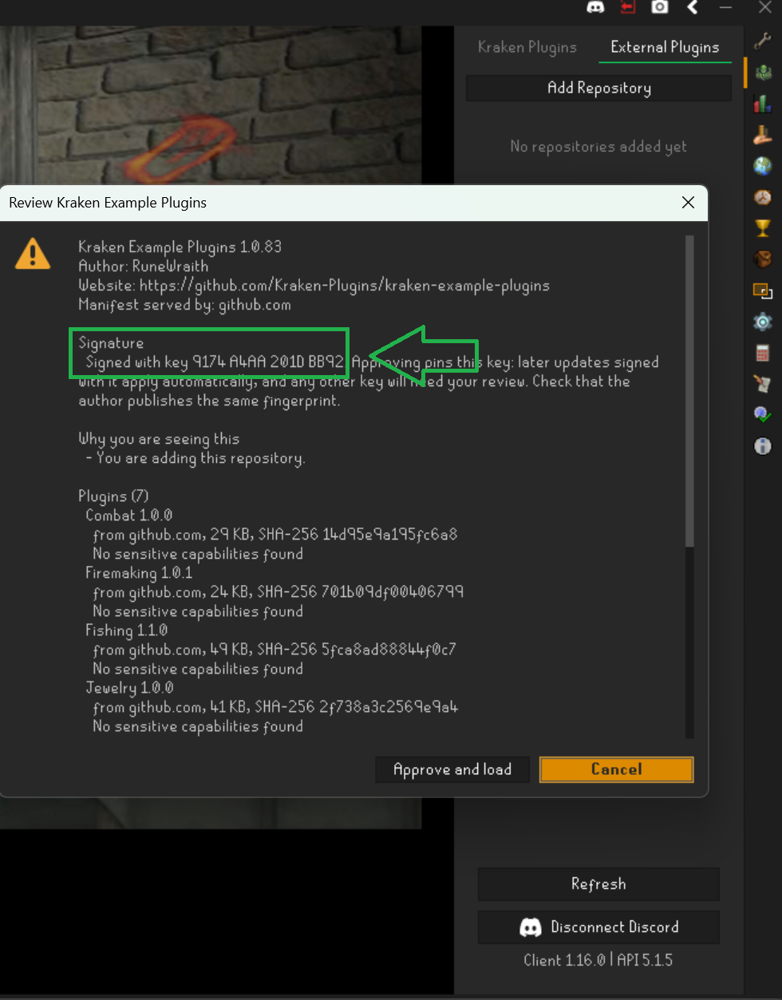

<br />
<div align="center">
  <a href="https://kraken-plugins.com">
    
  </a>

<h3 align="center">Kraken Example Plugins</h3>

  <p align="center">
   An set of example plugins utilizing the Kraken API
    <br />
</div>

[![Contributors][contributors-shield]][contributors-url]
[![Forks][forks-shield]][forks-url]
[![Stargazers][stars-shield]][stars-url]
[![Issues][issues-shield]][issues-url]

# Kraken Example Plugins

This repository contains examples for writing plugins using the [Kraken API](https://github.com/cbartram/kraken-api.git).
The Kraken API extends the RuneLite API with the ability to interact with various game entities, including:

- Widgets (Prayers, Spells, Interfaces, etc...)
- NPC's
- Players
- Ground Items
- Game Objects
- Equipment
- World Hopping
- Container Items (Inventory, Bank, etc...)
- and more!

The Kraken API also ships with several handy features for developing plugins right on top of RuneLite.
This repository contains several examples of fully functioning automation scripts showcasing the API's capabilities.

### Plugin & Script Requirements

You can read more about the individual plugins, their features, and their requirements
in their respective README's linked below.

- [Mining Plugin](docs/MINING.md)
- [Woodcutting Plugin](docs/WOODCUTTING.md)
- [Fishing Plugin](docs/FISHING.md)
- [Jewelry Plugin](docs/JEWELRY.md)
- [Firemaking Plugin](docs/FIREMAKING.md)
- [Runecrafting Plugin](docs/RUNECRAFTING.md)

> **Note:** These plugins are dependent on the [Kraken API](https://github.com/Kraken-Plugins/kraken-api) and require the Kraken Client to be installed. We strongly
> recommend using the [Kraken Client](https://kraken-plugins.com/) to make testing and using these plugins simple.

# QuickStart

Because the [Kraken API](https://github.com/Kraken-Plugins/kraken-api) is required on the Runtime classpath we recommend using the [Kraken Client](https://kraken-plugins.com/docs/client/download.html) to sideload the plugins
as it already loads the [Kraken API](https://github.com/Kraken-Plugins/kraken-api) automatically. This ensures you don't have to write your own plugin loader! The
following steps assume you are using the Kraken client.

Instructions for setting up the Kraken Client can [be found here](https://kraken-plugins.com/docs/client/download.html).

If you'd prefer to run the plugins individually or without the Kraken Client, then each plugin has its own test file
in `{plugin}/src/test/Run{Plugin}PluginTest.java` class which will run the plugin in RuneLite. Remember to add `-ea` to 
your JVM assertions!

## Run with External Repository

The Kraken client supports loading plugins from external repositories, including this one! To load these 
plugins, simply add this repo as a source for the plugins.


Paste the link to the repositories latest manifest here in the dialogue:

`https://github.com/Kraken-Plugins/kraken-example-plugin/releases/latest/download/manifest.json`

Once you add this repository, the plugins will be loaded automatically:


You will find your plugins in the Kraken plugins list:


## Plugin Verification

The plugins and manifest being loaded into your client is signed. You can verify it by comparing what you see in the client
with this fingerprint:

```text
9174A4AA201DBB92
```



## Run with the Kraken Gradle plugin

This build applies the [Kraken Gradle plugin](https://github.com/Kraken-Plugins/kraken-gradle-plugin), which launches
your installed [Kraken client](https://kraken-plugins.com/) with the plugins you build sideloaded. Install the Kraken
client first, then run:

```shell
# Every example plugin at once
./gradlew runKraken

# A single plugin
./gradlew :mining:runKraken

# Log in as a Jagex profile linked with the Profiles plugin, and/or wait for a debugger on port 5005
./gradlew :mining:runKraken --profile RuneWraith --debug-jvm
```

`runKraken` builds the plugin jars and starts the client the same way the Kraken launcher does, so the client brings the
Kraken API built for the current RuneLite. Nothing is copied into `~/.runelite/kraken/sideloaded-plugins`.

To check that the Kraken API you compile against works with the one your client runs:

```shell
./gradlew :mining:krakenVersions
```

### Sideloading by hand

You can also copy the built jars from `./build/plugins` into `~/.runelite/kraken/sideloaded-plugins`. The Kraken client
loads every jar in that directory at startup, and the plugins appear in the list of Kraken plugins.


## Building

To set up your development environment, we recommend following [this guide on RuneLite's Wiki](https://github.com/runelite/runelite/wiki/Building-with-IntelliJ-IDEA).
Use JDK 17. The Kraken API comes from the public Kraken Maven repository (`https://repo.kraken-plugins.com`), so no
GitHub account or token is needed.

```shell
./gradlew clean buildAndCollectSimpleJars --parallel
```

Your plugin jars will be built in the `./build/plugins` directory.

The `Run<Plugin>PluginTest` classes still work for running a single plugin from the IDE without the Kraken client. Add
`-ea` to the VM args and `--developer-mode` to the program arguments. That path runs plain RuneLite with the Kraken API
you compile against, so keep `krakenApiVersion` and `runeLiteVersion` in `build.gradle` current.

## Gradle Kraken API

To use the Kraken API in your own plugin, add the Kraken repository and the Gradle plugin:

```groovy
// settings.gradle
pluginManagement {
    repositories {
        maven { url = 'https://repo.kraken-plugins.com' }
        gradlePluginPortal()
    }
}
```

```groovy
// build.gradle
plugins {
    id 'com.krakenplugins.plugin' version '0.1.0'
}

repositories {
    maven { url = 'https://repo.runelite.net' }
    maven { url = 'https://repo.kraken-plugins.com' }
    mavenCentral()
}

dependencies {
    compileOnly 'net.runelite:client:1.13.1'
    compileOnly 'com.github.kraken:kraken-api:5.1.7'
}
```

See [the Kraken API docs](https://github.com/Kraken-Plugins/kraken-api?tab=readme-ov-file#gradle-example-recommended) for more.

## 🛠 Built With

* [Java](https://www.java.org/) — Core language
* [Gradle](https://gradle.org/) — Build tool
* [RuneLite](https://runelite.net) — Used for as the backbone for the API
* [Kraken API](https://github.com/Kraken-Plugins/kraken-api) – Interaction API

---

## 🤝 Contributing

Please read [CONTRIBUTING.md](CONTRIBUTING.md) for details on our code of conduct and the process for submitting pull requests.

---

## 🔖 Versioning

We use [Semantic Versioning](http://semver.org/).
See the [tags on this repository](https://github.com/Kraken-Plugins/kraken-api/tags) for available releases.

---

## 📜 License

This project is licensed under the [GNU General Public License 3.0](LICENSE.md).

---

## 🙏 Acknowledgments

* **RuneLite** — The splash screen and much of the core codebase come from RuneLite.
* **Microbot** — For clever ideas on client and plugin interaction.
* **Packet Utils** - Plugin from Ethan Vann providing access to complex packet sending functionality which was used to develop the core.packet package of the API


[contributors-shield]: https://img.shields.io/github/contributors/Kraken-Plugins/kraken-example-plugin.svg?style=for-the-badge
[contributors-url]: https://github.com/Kraken-Plugins/kraken-example-plugin/graphs/contributors
[forks-shield]: https://img.shields.io/github/forks/Kraken-Plugins/kraken-example-plugin.svg?style=for-the-badge
[forks-url]: https://github.com/Kraken-Plugins/kraken-example-plugin/network/members
[stars-shield]: https://img.shields.io/github/stars/Kraken-Plugins/kraken-example-plugin.svg?style=for-the-badge
[stars-url]: https://github.com/Kraken-Plugins/kraken-example-plugin/stargazers
[issues-shield]: https://img.shields.io/github/issues/Kraken-Plugins/kraken-example-plugin.svg?style=for-the-badge
[issues-url]: https://github.com/Kraken-Plugins/kraken-example-plugin/issues